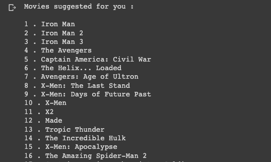

# Movie Recommendation System using Machine Learning

Building a movie recomendation system in Python where a user can provide a name of their favourite movie and the recommendation system will generate a list of movies based on their input.

## Table of Contents
- [Business Problem](#business-problem)
  * [Objective](#objective)
  * [Goal](#goal)
- [Data Source](#data-source)
- [Methods](#methods)
- [Tech Stack](#tech-stack)
- [Quick Analysis of Recommender System Results](#quick-analysis-of-recommender-system-results)
  * [Feature Selection and Importance](#feature-selection-and-importance)
  * [Insights and Recommendations Derived from Experimental Analysis](#insights-and-recommendations-derived-from-experimental-analysis)
  * [Limitations and Suggestions for Optimization of the Recommendation System](#limitations-and-suggestions-for-optimization-of-the-recommendation-system)
- [Simplify Your Analysis: Open in **Google Colab** for Improved Readability](#simplify-your-analysis-open-in-google-colab-for-improved-readability)

 
*get keywords in an build seo value

`hello`

## Business Problem
### Objective:
ABC Streaming Service is a popular platform for streaming movies and TV shows. In order to improve their user experience and increase customer retention, ABC Streaming Service wants to develop a movie recommendation system that helps users discover new movies they will enjoy. However, traditional recommendation systems based solely on user ratings and movie genres are not providing sufficiently personalized recommendations. 

### Goal:
To solve this problem, the goal of this project is to develop a movie recommendation system that incorporates a unique approach to movie analysis, such as using keyword similarity for sentiment analysis of user reviews, in addition to traditional data sources.

The recommendation system will synthesise fundamental principles of data analysis and data science, including:
* How to carry out data collection and pre-processing of various data sources, including user ratings, movie metadata, and other sources of movie information. 
* Create a system using cosine similarity to find movies that are similar to each other based on their features, such as the genre, keywords, tagline, cast and director. 

This will produce results that should be able to provide users with more accurate and diverse recommendations, leading to increased user engagement and satisfaction. This in turn will drive higher retention rates and reduce churn leading to increased revenue for the upcoming quarter.

## Data Source
[Kaggle data source containing movies and tv shows](https://www.kaggle.com/datasets/rachanakoniki/movies)

## Methods

## Tech Stack
- Python (refer to requirement.txt for the packages used in this project)

## Quick Analysis of Recommender System Results
Recommendation list after user input of: iron man

### Feature Selection and Importance
### Insights and Recommendations Derived from Experimental Analysis
### Limitations and Suggestions for Optimization of the Recommendation System

## Simplify Your Analysis: Open in **Google Colab** for Improved Readability
